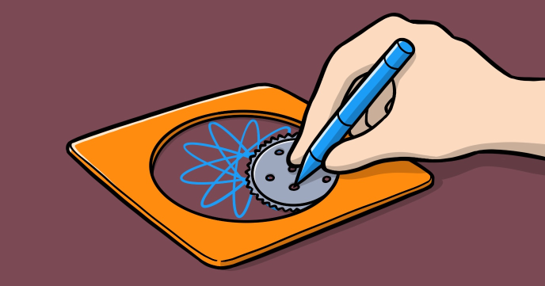

At a glance the Micro Spiragraph is nothing else than a visual entertaining program. You can run it and enjoy the amazing shapes left behind.

However, by implementing it, the program will teach you many valuable coding concepts such as:

-	How to work with trigonometric functions
-	How to push and shift values to / from an array
-	How to use JavaScript objects to store complex information
 
## Source code 
The JavaScript source code of this program can be found [here](sketches/program.js). To run it, you need to import it in the [codeguppy.com](https://codeguppy.com) online editor. Alternatively, you can use the source code in your p5.js sketches (advanced use). 
## Online version 
To see the code running, check the online playground at [https://codeguppy.com/code.html?t=micro_spirograph](https://codeguppy.com/code.html?t=micro_spirograph) 
## Next steps 
Please check [codeguppy.com](https://codeguppy.com) for many other fun JavaScript programs and games for beginners. To stay up to date with CodeGuppy development please follow [@codeguppy](https://twitter.com/codeguppy) on Twitter.  
